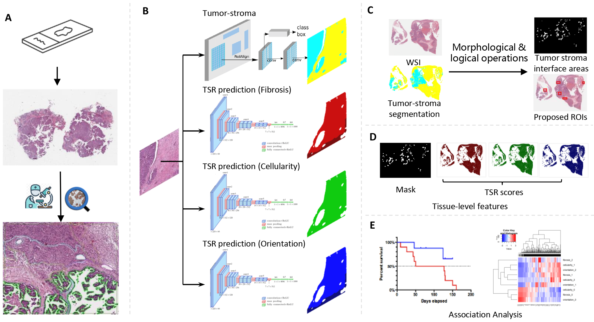
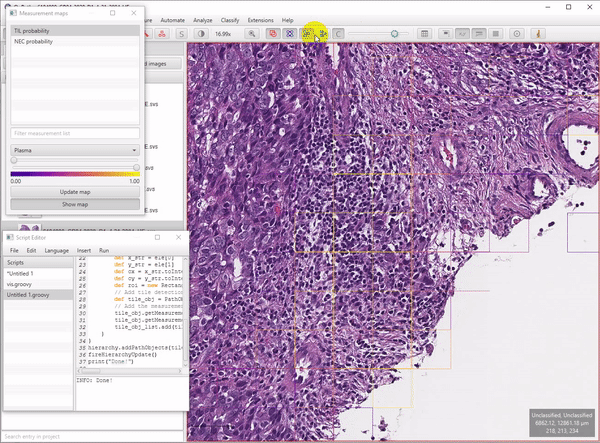

## Background
Similar to a process of normal wound healing, the proliferation of tumor cells create wound to adjacent tissues and 
tumor-stroma reaction (TSR) in cancer has been associated with increased extracellular matrix and production of 
growth factors to facilitate recovery growth of injured tissues. In ovarian cancers(OC), histopathological examination of 
tumor-stroma reaction is critical to differentiate low-grade serous carcinoma from serous borderline serous tumor (SBOT), with the latter lacking tumor triggered stroma reaction. More importantly, tumor-stroma reaction has been reported to facilitate tumorigenesis and associated with prognostic differences in many solid cancers such as cholangiocarcinoma, pancreatic cancer, melanoma, and OC.
However, paucity of study aims to overcome subjective bias or automate TSR evaluation for enabling association analysis to a large cohort. 
In this work, we proposed to use deep learning methods to computationally quantify TSR in whole slide images. The workflow is shown in Figure 1.
The predicted TSR scores were used to establish associations between tissue-level features, prognosis, and molecular pathways of high-grade serous ovarian carcinoma (HGSOC).


More details can be found in [our paper](https://www.frontiersin.org/articles/10.3389/fmed.2022.994467/full) published on Frontiers in Medicine [1].
### cite our work
```
author = {Jiang Jun, Tekin Burak, Yuan Lin, Armasu Sebastian, Winham Stacey J., Goode Ellen L., Liu Hongfang, Huang Yajue, Guo Ruifeng, Wang Chen},
title =  {{Computational tumor stroma reaction evaluation led to novel prognosis-associated fibrosis and molecular signature discoveries in high-grade serous ovarian carcinoma}},
journal  ={Frontiers in Medicine},
volume ={9},
doi  = {10.3389/fmed.2022.994467},
year  = {2022}
}
```

## Data Processing
Pathologists were invited to use polygons to label homogenous regions. Annotation criteria can be found in our paper.
For each region, stroma-reaction intensity scores measuring fibrosis, cellularity and orientation were assigned.  
According to task, annotations were parsed separately from QuPath with corresponding groovy scripts. Please refer to ./data_processing/*.groovy folder for details.
The annotated data will be divided into training, validation and testing dataset for model training (code in folder ./data_processing).

## Testing a H&E whole slide image
Please refer to the bash script in ./test_WSI.sh. You will be able to know the pipeline steps written in python code.
The pretrained models for ovarian tissue can be found [here](https://drive.google.com/drive/folders/139X9ddT0vRbVBafLvGGOzyTaS5DdRRLn?usp=drive_link) in our GoogleDrive. 
## Example Results 
Examples of TSR scoring results. Images in the first column are the original WSIs. The following columns are TSR scores measured from three metrics, including fibrosis (Red), cellularity (Green) and orientation (Blue). Each metric was encoded from dark to light color, denoting TSR score from low to high. Tumor regions were excluded in the evaluation. 


## Extension of this work (future work) 
We found Tumor Infiltrating Lymphocytes (TIL) are also common in some ovarian cancer cases. Accumulation research indicated that TIL is prognostic for increased survival. 
Our future work will focus on including more histopathological patterns (such as TIL) into analysis for deeper understanding of ovarian cancer development and treatment.
The animation below shows that we have got encouraging preliminaries by referring paper published by Dr. Saltz [[2]](https://www.cell.com/cell-reports/pdf/S2211-1247(18)30447-9.pdf).


## References
[1] Jiang, Jun, Burak Tekin, Lin Yuan, Sebastian Armasu, Stacey Winham, E. Goode, Hongfang Liu, Yajue Huang, Ruifeng Guo, and Chen Wang. "Computational tumor stroma reaction evaluation led to novel prognosis-associated fibrosis and molecular signature discoveries in high-grade serous ovarian carcinoma." Frontiers in medicine 9 (2022).   
[2] Saltz, Joel, Rajarsi Gupta, Le Hou, Tahsin Kurc, Pankaj Singh, Vu Nguyen, Dimitris Samaras et al. "Spatial organization and molecular correlation of tumor-infiltrating lymphocytes using deep learning on pathology images." Cell reports 23, no. 1 (2018): 181-193.


